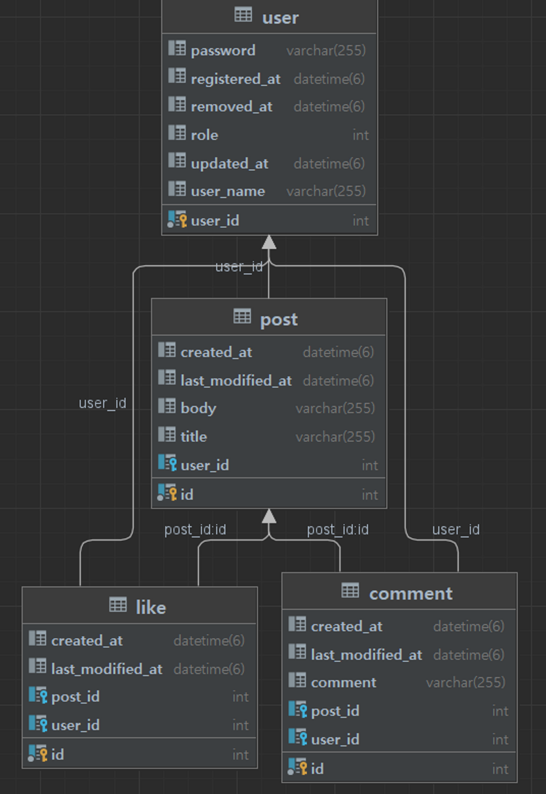

### 회원가입, 로그인, 게시물 등록 및 조회 구현 프로젝트 입니다.

#### SwaggerUi 주소

http://ec2-13-209-97-99.ap-northeast-2.compute.amazonaws.com:8080/swagger-ui/

#### 목표

회원가입을 통해 계정, 패스워드를 생성 및 로그인을 했을때 JWT가 생성되어 유저에게 전달 하고

스프링 시큐리티를 활용해 회원과 비회원의 권한을 다르게 설정 하는 것을 목표로 하였습니다.

#### 아쉬운 점

아직 익숙 하지 않아 알고보면 사소한 오류들 때문에 잡아먹힌 시간이 많아서 그런 점들을 줄였으면 좋았을 것 같고 아직 게시판 조회를 구현하지 못해서 리팩토링 시간때 구현을 해보고 싶습니다.
또한 주먹구구식으로 개발을 해 아직 정리가 잘 되어 있지 않은데 구조같은 것들도 그림으로 그려서 다시 정리하는 시간을 가졌으면 좋겠습니다.

#### ERD

 

#### ERD

