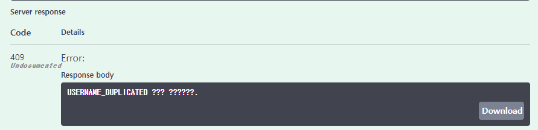

## 📋 게시판을 활용한 SNS 프로젝트

### 📌 AWS EC2를 통해 DOCKER IMAGE를 사용하여 컨테이너를 배포, 스프링 시큐리티를 사용한 회원가입, 로그인, 게시물 등록, 수정 및 조회, 댓글, 좋아요 기능이 포함된 프로젝트 입니다.

---

### 🖥️ 개발 환경

- 에디터 : Intellij Ultimate
- 개발 툴 : SpringBoot 2.7.6
- 자바 : JAVA 11
- 빌드 : Gradle 7.5.1
- 서버 : AWS EC2
- 배포 : Docker
- 데이터베이스 : MySql 8.0
- 라이브러리 : SpringBoot Web, MySQL, Spring Data JPA, Lombok, Spring Security

---

### 🛠️ 사용한 기술

Springboot

Springboot Security

AWS EC2

DOCKER

MySQL

---

#### 🚩 SwaggerUi 주소

http://ec2-54-180-82-12.ap-northeast-2.compute.amazonaws.com:8080/swagger-ui/

---

### 📈 목표

회원가입을 통해 계정, 패스워드를 생성 및 로그인을 했을때 JWT가 생성되어 유저에게 전달 하고

스프링 시큐리티를 활용해 회원과 비회원의 권한을 다르게 설정 하는 것을 목표로 하였습니다.

기존 게시판을 업그레이드 하고 다양한 기능을 추가할 예정입니다.
ex) 좋아요, 알림 기능 등

### 🙏 아쉬운 점

아직 익숙 하지 않아 알고보면 사소한 오류들 때문에 잡아먹힌 시간이 많아서 그런 점들을 줄였으면 좋았을 것 같았고,

또한 주먹구구식으로 개발을 해 아직 정리가 잘 되어 있지 않은데 구조같은 것들도 그림으로 그려서 다시 정리하는 시간을 가졌으면 좋겠습니다.

### 🗺️ ERD

#### 23-01-04 기존 ERD

 

#### 23-01-10 ERD 수정 및 추가

### api 실행 내용

- 도커를 통해 배포한 SwaggerUI 에서 진행하였습니다.

#### join 기능

> Request에 맞게 값 입력

> Response 양식에 따른 정상적인 출력 결과 (회원가입 완료)

> 중복값을 넣었을때 (이미 회원인 유저이름을 넣었을 때)

#### login 기능

> Request에 맞게 값 입력

> Response 양식에 따른 정상적인 출력 결과 (로그인 완료)

- 로그인에 성공을 했을땐 토큰을 반환하며, 비밀번호는 스프링 시큐리트를 사용해 암호화하여 저장합니다.

> 비밀번호 틀렸을 때

> 회원가입 하지 않은 유저가 로그인 했을 때

